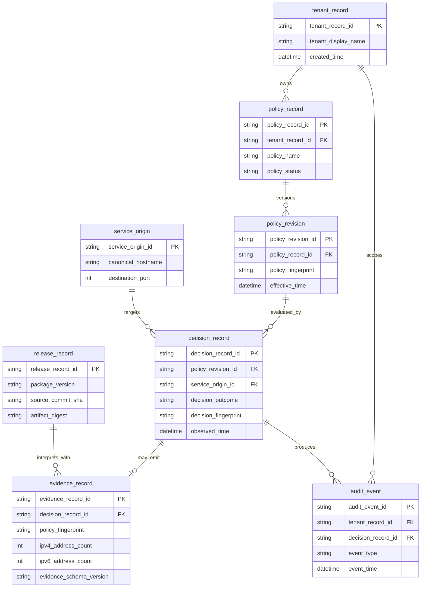
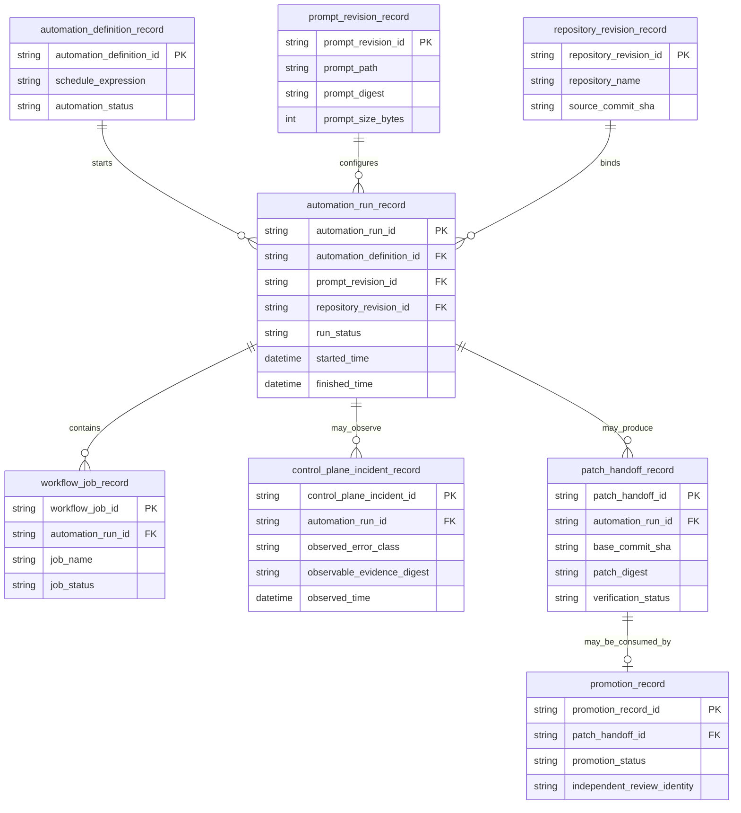

# EgressWeave persistence boundary and conceptual ERD

Status: **PRESENT-CURRENT** for ownership. The entity relationship models below are **NON-NORMATIVE** and host/platform-owned.

## Persistence decision

**EgressWeave core owns no durable database.** Protected-main EgressWeave is an in-process provider-neutral security library. It owns immutable configuration/value objects, validated request state, bounded transport behavior and optional detached decision evidence in process memory. It does not own tenant databases, credential stores, job queues, durable audit logs, automation scheduler stores, retention workflows or application observability backends.

A host may persist selected EgressWeave evidence, and an automation platform may persist workflow/run/incident evidence, but such persistence is **host-owned** or **platform-owned**. Those owners define authentication, tenant authorization, encryption, retention, deletion, legal basis, backup, disaster recovery and access logging. This document therefore does not create a migration contract or physical schema for the EgressWeave package.

See [`../adr/0002-documentation-governance-and-persistence-boundary.md`](../adr/0002-documentation-governance-and-persistence-boundary.md), [`../adr/0004-bounded-canonical-automation-prompt.md`](../adr/0004-bounded-canonical-automation-prompt.md), and root [`../../ARCHITECTURE.md`](../../ARCHITECTURE.md).

## Core runtime and automation objects: not database entities

The following are runtime types, workflow evidence concepts or conceptual responsibilities; they are **not EgressWeave database entities**:

- `EgressPolicy`
- `EgressTimeoutPolicy`
- `EgressConnectionPoolPolicy`
- `TLSConfiguration`
- `ValidatedEgressURL`
- `EgressDecisionEvidence`
- synchronous/asynchronous pinned transports
- `automation_run_record`
- `control_plane_incident_record`
- canonical prompt bytes and prompt validation results
- workflow job/check/review state
- verified patch handoff and promotion state

The first group is defined by product code and the public API contract. The automation evidence group is repository/platform governance state. Neither group creates package-owned durable persistence.

## NON-NORMATIVE host-owned runtime audit model

The following model shows how a host could persist minimized operational evidence without assigning database ownership to the library. Names deliberately use descriptive two-or-more-word `snake_case`.

This model intentionally omits request/response bodies, credentials, raw resolved IP addresses and full URL paths. A host that needs additional fields must perform its own data classification, purpose limitation and access-control review.

## NON-NORMATIVE platform-owned automation evidence model

The next conceptual model exists only to make the scheduler ownership boundary reviewable. A GitHub/organization/automation platform may retain equivalent records, but EgressWeave core neither defines nor migrates them.

These names are conceptual and **platform-owned**. `automation_run_record` and `control_plane_incident_record` are explicitly not EgressWeave database entities. The exact external scheduler error code may be absent; the platform record must distinguish observable evidence from inferred or unknown cause.

## Ownership matrix

| Concern | EgressWeave core | Host/automation platform |
|---|---|---|
| Security policy value objects | Owns | Constructs from reviewed configuration |
| DNS validation and pinned transport | Owns | Supplies network environment |
| Decision evidence structure | Owns public in-memory contract | Chooses whether/where to persist |
| Tenant model | Does not own | Host owns |
| Credentials and secrets | Does not own | Host/platform owns |
| Runtime audit database | Does not own | Host owns |
| Automation run/incident store | Does not own | Automation platform owns |
| Prompt revision and workflow job records | Does not own | Repository/automation platform owns |
| Retention/deletion | Does not own | Host/platform owns |
| Backup/restore | Does not own | Host/platform owns |
| Service-mesh/firewall policy | Does not own | Host owns as defense in depth |

## Migration rule

No database migration belongs in EgressWeave solely because these conceptual ERDs exist. A future change that makes durable persistence part of the package requires a new or superseding Accepted ADR, a physical data model, migration/rollback strategy, tenant/security ownership, backup/restore behavior, deletion/retention requirements and realistic migration tests before implementation can be called shipped.
