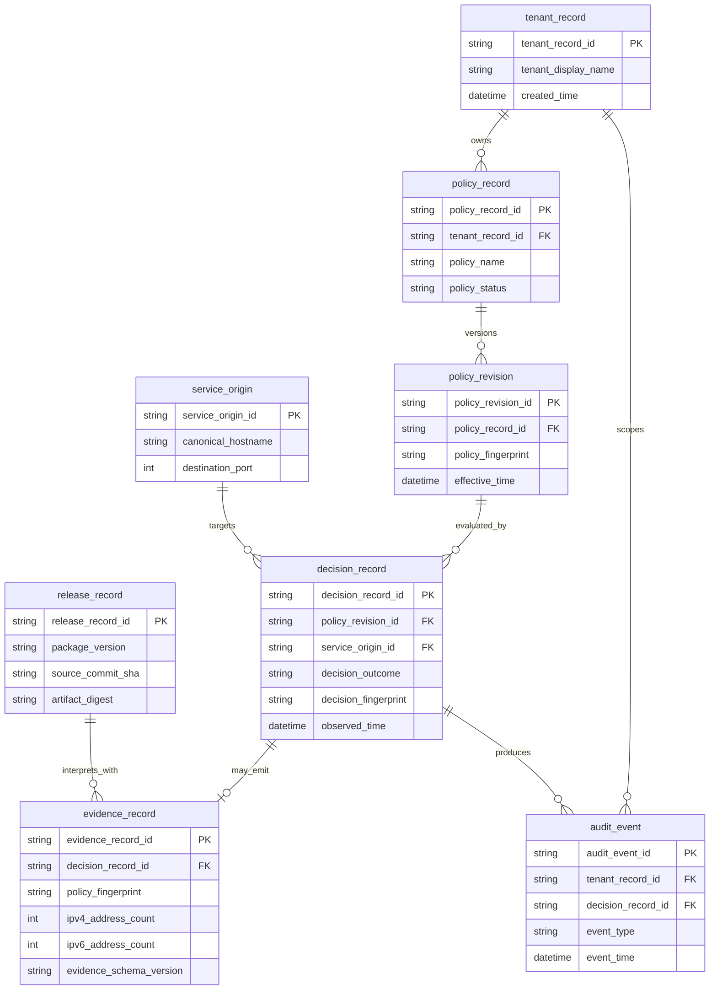

# EgressWeave persistence boundary and conceptual ERD

Status: **PRESENT-CURRENT** for ownership. The entity relationship model below is **NON-NORMATIVE** and host-owned.

## Persistence decision

**EgressWeave core owns no durable database.** Protected-main EgressWeave is an in-process provider-neutral security library. It owns immutable configuration/value objects, validated request state, bounded transport behavior and optional detached decision evidence in process memory. It does not own tenant databases, credential stores, job queues, durable audit logs, retention workflows or application observability backends.

A host may persist selected EgressWeave evidence, but such persistence is **host-owned**. The host defines authentication, tenant authorization, encryption, retention, deletion, legal basis, backup, disaster recovery and access logging. This document therefore does not create a migration contract or physical schema for the EgressWeave package.

See [`../adr/0002-documentation-governance-and-persistence-boundary.md`](../adr/0002-documentation-governance-and-persistence-boundary.md) and root [`../../ARCHITECTURE.md`](../../ARCHITECTURE.md).

## Core runtime objects: not database entities

The following are runtime types or conceptual responsibilities, not persisted EgressWeave tables:

- `EgressPolicy`
- `EgressTimeoutPolicy`
- `EgressConnectionPoolPolicy`
- `TLSConfiguration`
- `ValidatedEgressURL`
- `EgressDecisionEvidence`
- synchronous/asynchronous pinned transports

Their source-of-truth definitions are code and the public API contract, not this ERD.

## NON-NORMATIVE host-owned audit model

The following model shows how a host could persist minimized operational evidence without assigning database ownership to the library. Names deliberately use descriptive two-or-more-word `snake_case`.

This model intentionally omits request/response bodies, credentials, raw resolved IP addresses and full URL paths. A host that needs additional fields must perform its own data classification, purpose limitation and access-control review.

## Ownership matrix

| Concern | EgressWeave core | Host application/platform |
|---|---|---|
| Security policy value objects | Owns | Constructs from reviewed configuration |
| DNS validation and pinned transport | Owns | Supplies network environment |
| Decision evidence structure | Owns public in-memory contract | Chooses whether/where to persist |
| Tenant model | Does not own | Owns |
| Credentials and secrets | Does not own | Owns |
| Audit database | Does not own | Owns |
| Retention/deletion | Does not own | Owns |
| Backup/restore | Does not own | Owns |
| Service-mesh/firewall policy | Does not own | Owns as defense in depth |

## Migration rule

No database migration belongs in EgressWeave solely because this conceptual ERD exists. A future change that makes durable persistence part of the package requires a new or superseding Accepted ADR, a physical data model, migration/rollback strategy, tenant/security ownership, backup/restore behavior, deletion/retention requirements and realistic migration tests before implementation can be called shipped.
