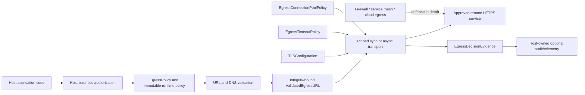
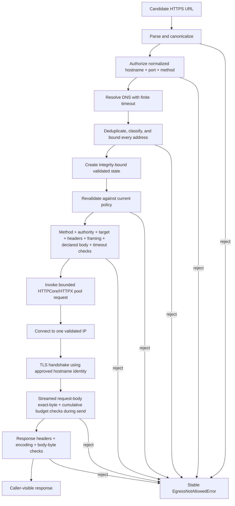
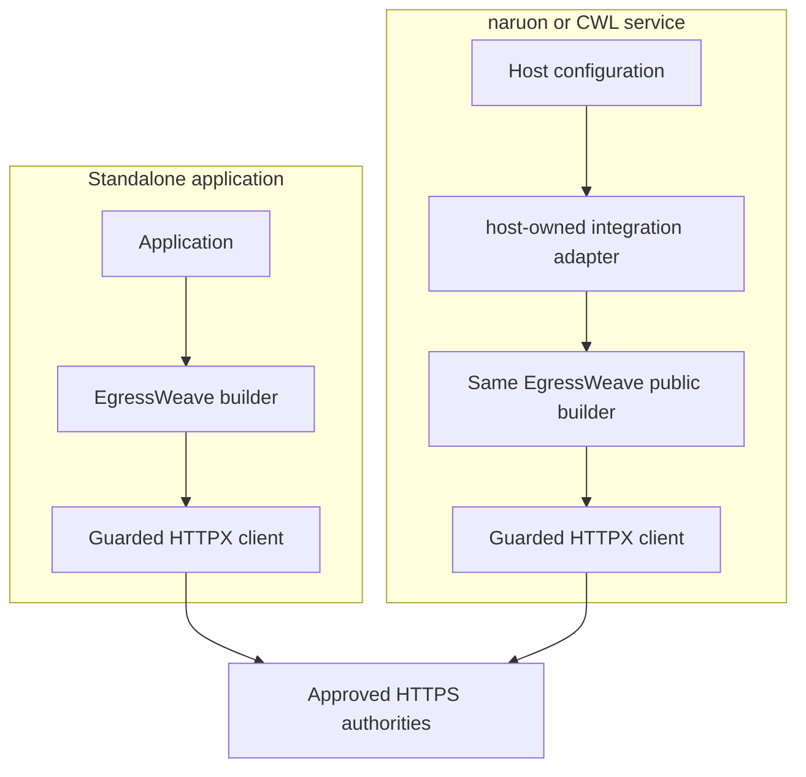

# EgressWeave System Architecture Views

Status: Proposed supplementary views of **IMPLEMENTED-ON-PROTECTED-MAIN** behavior. Root [`../../ARCHITECTURE.md`](../../ARCHITECTURE.md) remains authoritative when this document and implementation disagree.

## 1. System context

EgressWeave is embedded inside a host application. It constrains outbound HTTP authority but does not own business authorization, durable persistence, tenant identity, host integration-adapter implementation, or network perimeter enforcement.

## 2. Authority-preserving request path

The transport completes method, authority, request-target, final-header, framing, declared-body-size, and timeout-extension validation before it calls the connection pool. The bounded request-body wrapper is consumed lazily by HTTPCore during the network send, so exact-byte and cumulative streamed-body accounting occurs only after the pool has established the applicable connection/TLS path. The diagram therefore distinguishes pre-network validation from checks that necessarily occur while the body is being transmitted rather than implying that all request checks happen after TLS.

The validated IP is a connection target, not a new logical authority. SNI, certificate hostname validation, and HTTP authority continue to use the normalized approved hostname.

## 3. Component ownership

| Component | Core responsibility | Explicitly not owned |
|---|---|---|
| Policy normalization | Exact host/authority, method, local-address and finite-resource configuration | User/tenant/business-object authorization |
| URL validation | HTTPS syntax, canonical hostname, authority/method gating | Business meaning of paths/query/body |
| DNS validation | Finite resolution, every-candidate classification, candidate cap | DNS infrastructure availability/SLA |
| Validated state | Bind accepted authority/addresses/policy identity | Permanent capability semantics |
| Pinned transport | Validated-IP TCP with hostname TLS/HTTP identity | Arbitrary proxies, Unix sockets, redirects |
| Request safety | Method/header/target/framing/body budgets | Credential scope or payload meaning |
| Response safety | Header/body/content-coding resource boundary | Malware/content classification |
| TLS configuration | Trust roots, client identity, protocol policy | Enterprise CA lifecycle/KMS |
| Decision evidence | Bounded deterministic accepted-decision facts | Durable audit database or certification claim |
| Host-owned integration adapter | Translate host config into public core objects outside this package | EgressWeave-owned provider/tenant/configuration lifecycle |

## 4. Standalone and host-owned integration views

The naruon/CWL branch is a **NON-NORMATIVE external integration example**, not a packaged protected-main EgressWeave component. The modularity invariant is that any host-owned adapter reuses the same public policy/validation/transport layer. Cross-repository integration must not create hidden coupling to a mutable branch or duplicate the core SSRF policy.

## 5. Runtime trust boundaries

### Trusted startup configuration

Allowed authorities, methods, local-address decisions, TLS configuration, finite timeout/pool/resource policies, and host integration configuration must come from a trusted deployment/control plane.

### Untrusted runtime inputs

URLs, DNS answers, HTTP metadata, streaming chunks, remote responses, dependency exceptions, and cleanup behavior are treated as untrusted. They may cause a stable denial but may not widen destination authority.

### Host-owned sensitive context

Credentials, application payloads, users, tenants, business authorization, detailed logs, integration adapters, and persistence remain outside the core evidence model.

## 6. Denial and cleanup architecture

Once policy denial is decided, cleanup is best-effort and subordinate to the public denial contract. Dependency-controlled cleanup failure must not replace a security denial. Interpreter/process control-flow exceptions and caller/coordinator cancellation remain explicitly separated from dependency-child failure according to the implemented sync/async contracts.

See [`UML.md`](UML.md) for sequence/state views and [`../product/TEST_STRATEGY.md`](../product/TEST_STRATEGY.md) for regression requirements.

## 7. Development and release authority

Repository automation is intentionally separated from runtime product authority. Protected-main behavior is determined by merged source plus required checks/reviews. Product-development model execution, PR maintenance/review, release publication, and organization control-plane workflows may use different identities and permissions; success in one lane must not be reinterpreted as authority in another.

Automation changes that exist only on an **ACTIVE-PR** are not part of this current system architecture until protected merge and operational acceptance.

## 8. Persistence boundary

EgressWeave core does not persist policies, requests, responses, credentials, decision evidence, or audit events. See [`ERD.md`](ERD.md) for the explicit no-owned-database decision and a NON-NORMATIVE host integration model.
