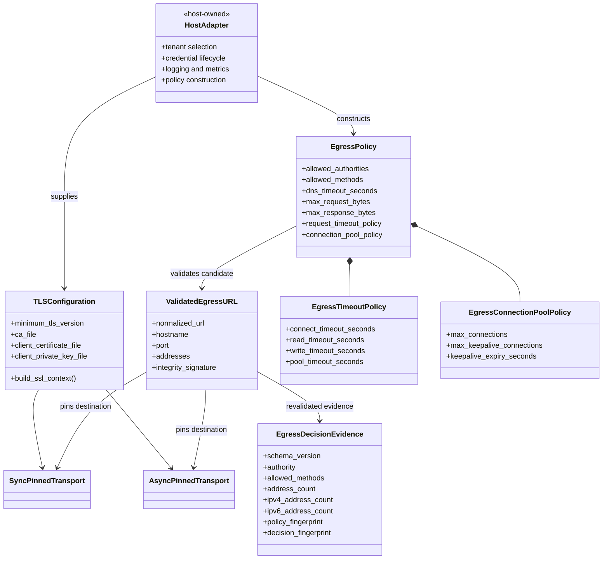
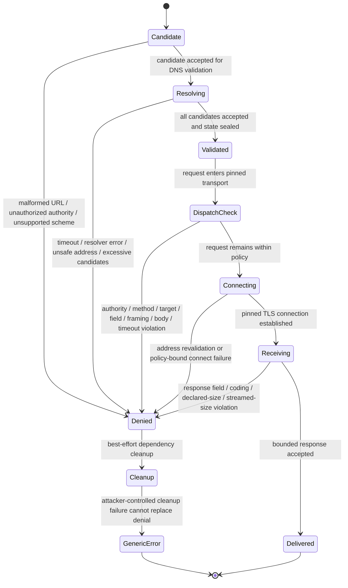
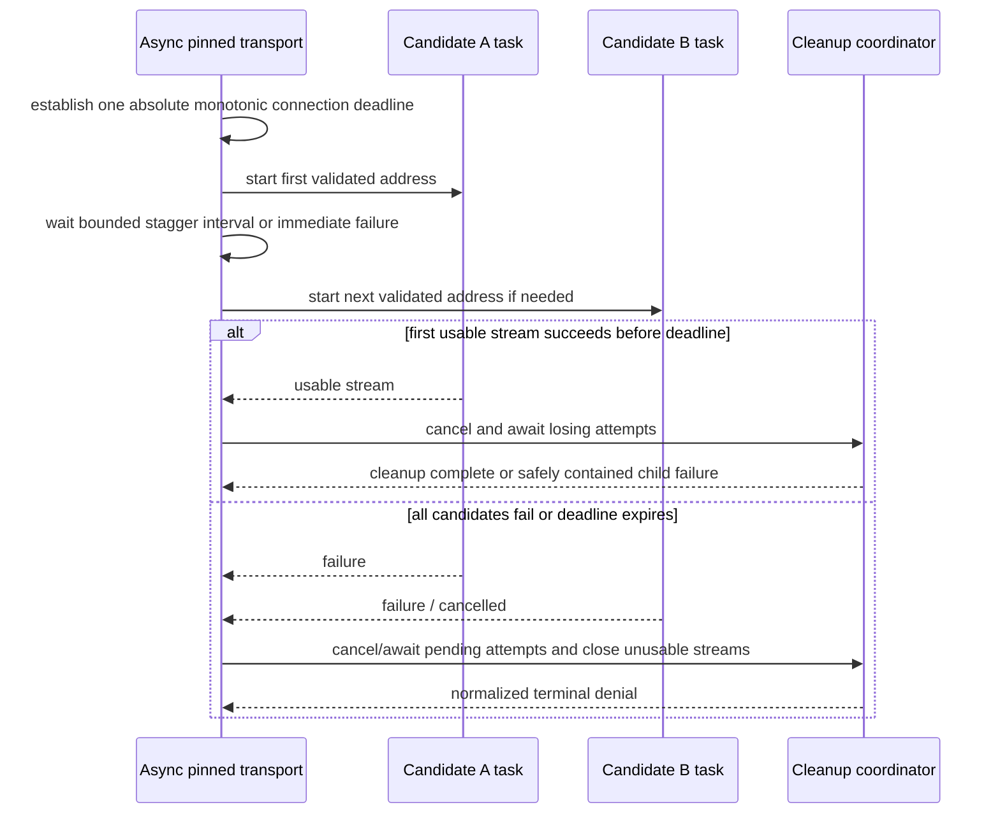
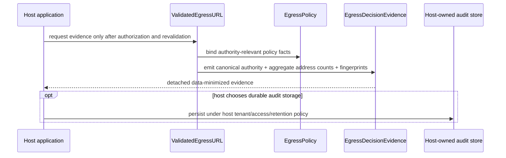
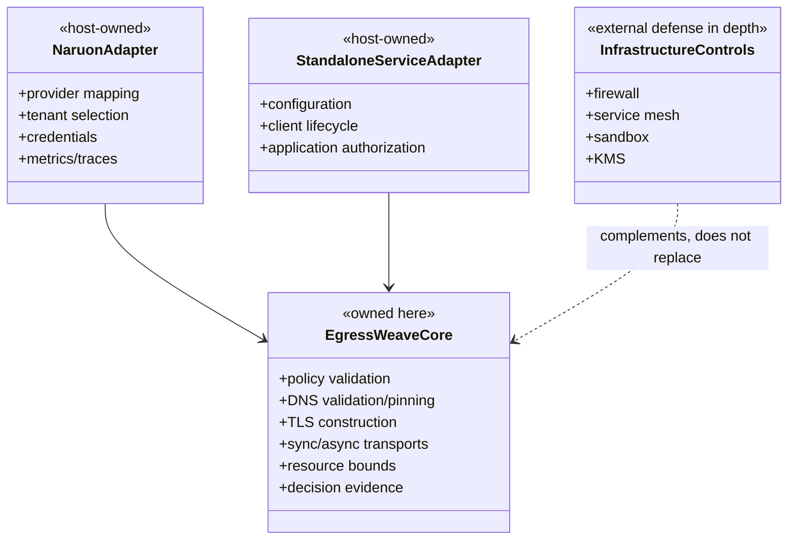
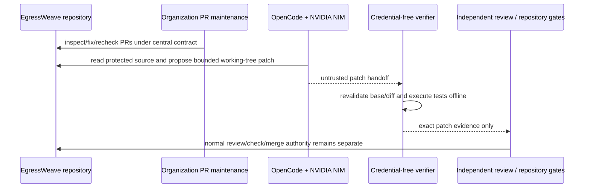
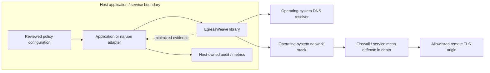

# EgressWeave UML and behavior views

Status: **PRESENT-CURRENT** for protected-main runtime behavior unless a diagram is explicitly marked otherwise. Root [`../../ARCHITECTURE.md`](../../ARCHITECTURE.md) remains the authoritative implementation architecture.

These diagrams are review aids, not independent authority. If a diagram conflicts with code or root architecture, the code-current root architecture wins and this file must be corrected.

## 1. Core type and responsibility model



The host adapter is intentionally outside the core package. Provider registries, tenant authorization, credentials, persistence, queues, deployment and business-level path/body authorization remain host responsibilities.

## 2. Validation-to-request sequence

```mermaid
sequenceDiagram
    participant App as Application / naruon adapter
    participant Policy as EgressPolicy
    participant Validator as URL validation
    participant Resolver as OS resolver
    participant State as ValidatedEgressURL
    participant Transport as Pinned transport
    participant Peer as Remote TLS service

    App->>Policy: construct reviewed immutable policy
    App->>Validator: candidate HTTPS URL + policy
    Validator->>Policy: verify exact normalized authority and method policy
    Validator->>Resolver: resolve hostname under finite deadline
    Resolver-->>Validator: A / AAAA candidates
    Validator->>Validator: bound count; reject if any address class is disallowed
    Validator->>State: create integrity-bound validated state
    App->>Transport: build client from state + policy + TLS configuration
    Transport->>State: verify integrity, authority, address set and scope
    Transport->>Transport: validate method, target, headers, body and phase budgets
    Transport->>Peer: connect only to pinned revalidated address with original TLS identity
    Peer-->>Transport: response metadata and identity-coded body
    Transport->>Transport: enforce response field and max_response_bytes budgets
    Transport-->>App: caller-visible response or generic policy denial
```

## 3. Fail-closed request lifecycle



`KeyboardInterrupt`, `SystemExit`, `GeneratorExit`, and outer coordinator cancellation retain their separately tested control-flow semantics where applicable; ordinary dependency-controlled cleanup failures do not become a policy oracle.

## 4. Asynchronous connection-race behavior



The exact implementation details evolve through reviewed pull requests; protected-main code and tests determine which refinements are currently shipped.

## 5. Decision-evidence production



The core does not emit raw credentials, bodies or resolved IP addresses in this evidence model.

## 6. Standalone and CWL modular boundary



## 7. Automation authority separation

The repository has separate governance and product-development paths. Current protected-main implementation and active PRs must be distinguished in the product documentation fitness matrix.



Repository-local autonomous model execution must not be treated as independent approval, security scanning, release authority or deployment authority.

## 8. Deployment view



EgressWeave is an in-process library, not an independently deployed proxy service on protected main.
