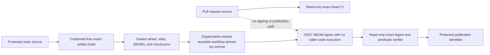

# Deterministic SBOM attestation compatibility

## Decision

EgressWeave keeps the deterministic CycloneDX 1.7 evidence foundation in
`scripts/ci/generate_release_sbom.py` and adds a narrow compatibility adapter in
`scripts/ci/generate_attestable_release_sbom.py`.

The adapter exists because the reviewed `actions/attest` v4.1.0 CycloneDX parser
at commit `59d89421af93a897026c735860bf21b6eb4f7b26` accepts a document only when
`bomFormat`, `specVersion`, and `serialNumber` are all present. The foundation
intentionally omitted `serialNumber` to avoid random output. Passing the
foundation output directly to that action would therefore fail before an SBOM
attestation could be created.

## Deterministic document identity

CycloneDX 1.7 recommends an RFC 4122 UUID URN for `serialNumber`. It also states
that every generated BOM should receive a unique serial even when content is
unchanged. EgressWeave applies a documented reproducibility profile instead:
identical exact artifacts and reviewed dependency evidence reuse one serial,
while any semantic document change produces another serial.

This deliberate `SHOULD` deviation is necessary because release acceptance
requires repeated builds of the same exact source and lockfiles to produce
byte-identical evidence before checksum and signature binding. A random serial
would make two otherwise identical verified builds differ. The CycloneDX
`version` remains `1` because one serial never identifies changed content; a
changed document receives a new content-bound serial rather than a new revision
of the old identity.

The adapter applies this fail-closed procedure:

1. Validate every reviewed dependency version, marker, and digest against the
   executable hash-locked runtime subset.
2. Build the reviewed CycloneDX document without a serial number.
3. Require an exact built-in JSON object with the CycloneDX 1.7 schema URL,
   `bomFormat` value `CycloneDX`, `specVersion` value `1.7`, and document
   `version` value `1`. Reject drift before adding an attestable identity because
   the upstream action's format detector checks presence rather than these exact
   values.
4. Recursively require the RFC 8259 data model: built-in dictionaries with
   built-in string keys, built-in lists, Unicode string values, built-in
   booleans and integers, finite built-in floating-point numbers, and `null`.
   Standards-library metadata string subclasses are accepted because they are
   immutable Unicode values serialized directly as JSON strings. Reject tuples,
   non-string object keys, container subclasses, non-string scalar subclasses,
   cycles, `NaN`, infinities, and arbitrary Python objects instead of allowing
   `json.dumps` to coerce them into different evidence semantics.
5. Serialize the complete document as sorted, compact, ASCII JSON with strict
   number handling.
6. Compute SHA-256 over those canonical bytes.
7. Append that digest to the stable EgressWeave SBOM identity URL namespace.
8. Derive an RFC 4122 UUID version 5 with the standard URL namespace.
9. Store the result as `urn:uuid:<uuid>` in `serialNumber`.

The UUID therefore identifies the complete SBOM semantics rather than only the
artifact filename. Any artifact digest, package identity, dependency version,
license, marker, relationship, property, schema, or generator change produces a
different document identity. Identical reviewed inputs produce the same UUID and
the same output bytes.

The UUID is an identity label, not a cryptographic signature. SHA-256 remains
the artifact and canonical-document binding. A signed attestation must still be
verified against the exact artifact digest, repository, protected workflow,
source commit, predicate type, and predicate bytes.

## Operator command

Build and verify the canonical distribution first, then run:

```bash
python scripts/ci/generate_attestable_release_sbom.py \
  --artifact dist/egressweave-<version>-py3-none-any.whl \
  --manifest scripts/ci/release_runtime_dependencies.json \
  --lock requirements-ci.txt \
  --output dist/egressweave-<version>-py3-none-any.whl.cdx.json
```

Repeat for the source distribution. Generate each document twice and compare the
bytes before signing. Reject the release if generation differs, the reviewed
runtime dependency closure drifts from the hash-locked runtime subset, the
foundation envelope is not exactly CycloneDX 1.7, the document contains a
Python-only coercion or another non-strict JSON value, the serial number is not
an RFC 4122 UUID URN, or the predicate type is not exactly
`https://cyclonedx.org/bom`.

The Python build API also requires the lock path. Direct build callers therefore
cannot produce adapter-generated attestable evidence while silently bypassing
dependency-lock parity.

## Workflow trust boundary

This compatibility slice does **not** change `.github/workflows/release.yml`.
That workflow contains credential-separated jobs that can create an immutable
tag, publish through PyPI OIDC, and publish a GitHub Release. A pull-request
branch must not introduce or retain new branch-controlled release behavior that
receives those identities.



The dashed edge is a prohibition, not a data flow: pull-request-controlled
source cannot reach signing or publication credentials. Only the sealed evidence
set produced from the exact protected-main head may cross into the organization
workflow.

Protected integration remains a separate, independently reviewed action tracked
by `ContextualWisdomLab/.github#783`:

- generate SBOMs only from the exact verified wheel and source distribution;
- add them to release evidence and `SHA256SUMS`, not the canonical PyPI input;
- use an immutable commit-pinned organization-owned reusable workflow and
  attestation action;
- grant the attestation job only the permissions required by the reviewed
  action, with repository contents remaining read-only;
- execute no caller-controlled source under OIDC or attestation credentials;
- verify the downloaded attestation bundle and exact predicate before public
  GitHub Release publication; and
- fail closed when protected main, the tag, artifact digest, workflow source,
  repository identity, predicate type, or predicate bytes differ.

No SLSA Build level is claimed by this adapter or by the existence of an SBOM
attestation alone.

## Recovery

If the serial number, SBOM bytes, or attestation do not verify, publish nothing.
Do not edit generated evidence, move an existing tag, or replace released bytes.
Correct the reviewed inputs through a normal pull request, rebuild from the new
exact protected-main head, and generate a new release version when any artifact
was already published.

## Authoritative references

Bradner, S. (1997). *Key words for use in RFCs to indicate requirement levels*
(RFC 2119). Internet Engineering Task Force.
https://doi.org/10.17487/RFC2119

Bray, T. (2017). *The JavaScript object notation (JSON) data interchange format*
(RFC 8259). Internet Engineering Task Force. https://doi.org/10.17487/RFC8259

Ecma International, & OWASP Foundation. (2025). *CycloneDX specification 1.7
(ECMA-424).* https://cyclonedx.org/specification/overview/

GitHub. (2026). *CycloneDX SBOM parsing and predicate generation* [Source code].
`actions/attest` (Version 4.1.0, commit
`59d89421af93a897026c735860bf21b6eb4f7b26`).
https://github.com/actions/attest/blob/59d89421af93a897026c735860bf21b6eb4f7b26/src/sbom.ts

GitHub. (n.d.). *Using artifact attestations to establish provenance for
builds.* GitHub Docs. Retrieved August 5, 2026, from
https://docs.github.com/en/actions/how-tos/secure-your-work/use-artifact-attestations/use-artifact-attestations

Internet Engineering Task Force. (2024). *Universally unique IDentifiers
(UUIDs)* (RFC 9562). https://doi.org/10.17487/RFC9562

in-toto Project. (n.d.). *CycloneDX predicate.* Retrieved August 5, 2026, from
https://github.com/in-toto/attestation/blob/main/spec/predicates/cyclonedx.md
